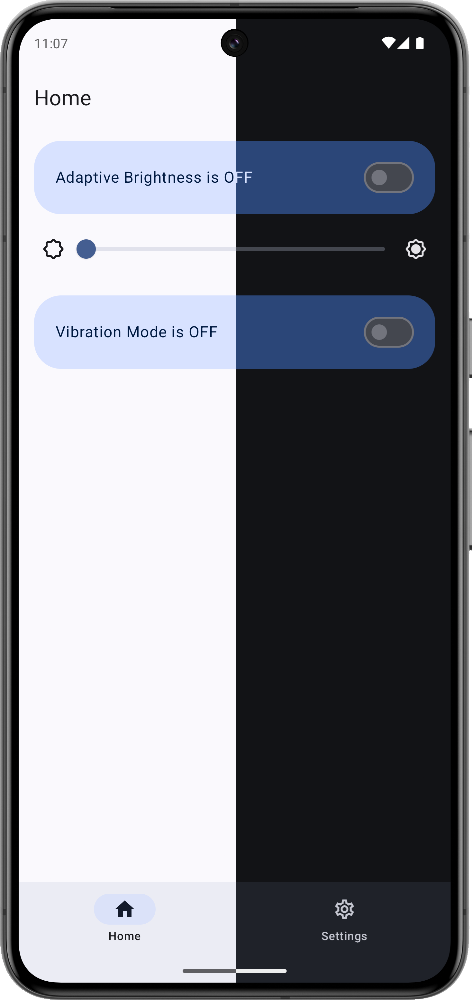

  
   
  Cerberus Tiles

  
  
  
  
  
  <a href="https://hits.seeyoufarm.com/api/count/graph/dailyhits.svg?url=https://github.com/bl4ckswordsman/CerberusTiles">
     <!-- Added 2024-02-14. This count views instead of visitors like the previous one did -->
</a>

## Introduction

Pixel phones don't offer quick access to some core settings, unlike some other Android phone manufacturers.

That's where Cerberus Tiles[^1] comes in, to add more quick settings tiles and shortcuts to your Google Pixel.
Ideal to be used with the back tap gesture.
Tested in a Pixel 8 Pro.

  
 Screenshots (Click to expand)

  
   

## Features

|                       | In-app toggle | App shortcut | Quick Settings tile |
|:---------------------:|:-------------:|:------------:|:-------------------:|
|  Adaptive Brightness  |       ✅       |      ✅       |          ✅          |
| Vibration Ringer Mode |       ✅       |      ✅       |          -          |
|    Overlay dialog     |       -       |      ✅       |          -          |
|           -           |               |              |                     |

> [!NOTE]
> More features coming soon.

### Kudos to:

[This cool Gradient Generator](https://doodad.dev/gradient-generator/), Bing Copilot for the
generated app icon etc.

[^1]: Name inspired by the multi-headed hound of Hades that guards the underworld.
